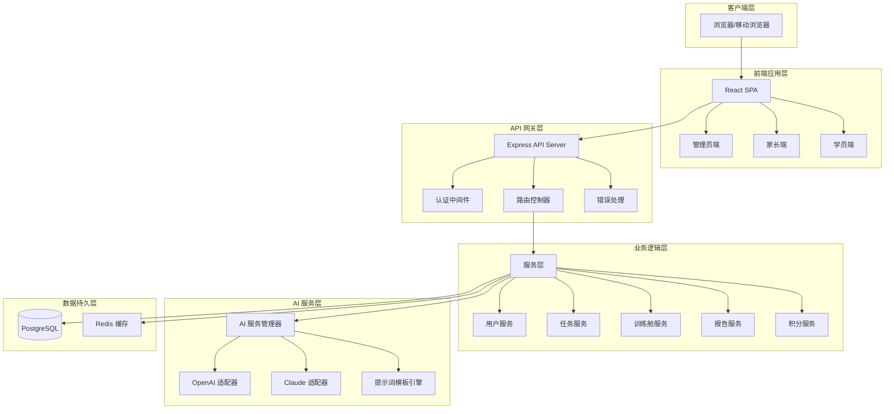
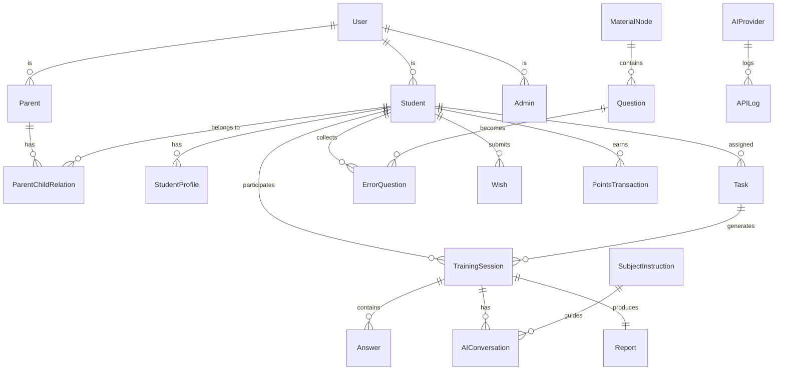

# 设计文档

## 概述

智能提分训练平台是一个基于 React + TypeScript + Node.js 的全栈 Web 应用，采用前后端分离架构。系统通过 AI 驱动的个性化学习引擎，为中小学生提供智能化的学习训练、错题管理和激励系统。

### 核心设计目标

1. **高还原度 UI**：严格还原设计稿的蓝白色调、布局和组件样式
2. **响应式三栏布局**：训练舱实现桌面端三栏、移动端自适应的布局方案
3. **AI 驱动智能化**：集成多 AI 服务商，提供启发式教学和报告生成
4. **模块化架构**：清晰的代码结构，便于团队协作和长期维护
5. **性能与可扩展性**：支持大规模并发，快速响应用户操作

### 技术栈选型

**前端：**
- React 18 + TypeScript
- Vite（构建工具）
- Tailwind CSS（样式框架）
- Zustand（状态管理）
- React Router（路由）
- Axios（HTTP 客户端）
- fast-check（属性测试库）

**后端：**
- Node.js + Express + TypeScript
- PostgreSQL（关系型数据库）
- Prisma（ORM）
- JWT（身份认证）
- OpenAI/Claude SDK（AI 服务集成）

**部署：**
- Docker + Docker Compose
- Nginx（反向代理）

## 架构

### 系统架构图



### 架构分层说明

**客户端层：**
- 支持桌面浏览器和移动浏览器
- 响应式设计自动适配不同屏幕尺寸

**前端应用层：**
- 单页应用（SPA）架构
- 按角色划分三个主要模块：管理员端、家长端、学员端
- 共享通用组件库和工具函数

**API 网关层：**
- 统一的 RESTful API 入口
- JWT 认证中间件验证用户身份
- 路由控制器分发请求到对应服务
- 全局错误处理和日志记录

**业务逻辑层：**
- 服务层封装核心业务逻辑
- 每个服务负责特定领域功能
- 服务间通过依赖注入实现解耦

**AI 服务层：**
- 抽象 AI 服务接口，支持多服务商切换
- 适配器模式封装不同 AI 服务商的 API
- 提示词模板引擎管理各科目的教学指令

**数据持久层：**
- PostgreSQL 存储结构化数据
- Redis 缓存热点数据和会话信息

## 组件与接口

### 前端组件架构

#### 通用组件库（Shared Components）

```typescript
// 布局组件
- Layout: 页面整体布局容器
- Sidebar: 侧边栏导航
- Header: 顶部导航栏
- Footer: 页脚

// 表单组件
- Input: 输入框
- Select: 下拉选择
- Button: 按钮
- Form: 表单容器
- DatePicker: 日期选择器

// 数据展示组件
- Table: 数据表格
- Card: 卡片容器
- Chart: 图表（雷达图、环形图、折线图）
- Badge: 徽章标签
- Progress: 进度条

// 反馈组件
- Modal: 模态对话框
- Toast: 消息提示
- Loading: 加载指示器
- Empty: 空状态占位
```


#### 管理员端组件（Admin Portal）

```typescript
// 页面组件
- AdminDashboard: 管理员仪表盘
- UserManagement: 用户管理列表
- StudentIDManagement: 学号管理中心
- AuthCodeManagement: 授权码管理
- MaterialSystemManagement: 教材体系管理
- AIServiceConfig: AI 服务商配置
- SubjectInstructionConfig: 科目教学指令配置
- APIMonitoring: API 监控看板

// 业务组件
- UserTable: 用户列表表格
- StudentIDDetail: 学号详情弹窗
- AuthCodeGenerator: 授权码批量生成器
- MaterialTree: 教材树形结构编辑器
- AIProviderForm: AI 服务商配置表单
- APIMetricsChart: API 指标图表
```

#### 家长端组件（Parent Portal）

```typescript
// 页面组件
- ParentDashboard: 家长仪表盘
- StudentOverview: 学情概览看板
- TaskConfigCenter: 任务配置中心
- TaskReportCenter: 任务报告中心
- WishApprovalList: 愿望审批列表
- ChildManagement: 亲子关系管理

// 业务组件
- StudentSwitcher: 学员切换器
- AbilityRadarChart: 能力雷达图
- ErrorRingChart: 错题攻克环形图
- LearningStreakCard: 连续学习统计卡片
- TaskPublisher: 任务发布器（档案模式/自定义模式）
- ReportViewer: 报告查看器
- WishApprovalCard: 愿望审批卡片
```

#### 学员端组件（Student Portal）

```typescript
// 页面组件
- StudentDashboard: 学员仪表盘
- TrainingCabin: 训练舱（核心功能）
- ErrorBook: 错题本中心
- ErrorRetry: 错题重做练习区
- PointsWishMall: 积分愿望商城
- ProfileManagement: 个人档案管理

// 训练舱子组件
- TrainingNavigation: 左侧进度导航栏
- QuestionArea: 中间题目交互区
- AIAssistant: 右侧 AI 对话框
- ProgressIndicator: 进度指示器
- QuestionRenderer: 题目渲染器
- AnswerInput: 答题输入组件
- ChatMessage: 聊天消息组件
- FloatingAIButton: 移动端浮动 AI 按钮

// 业务组件
- ErrorBookFilter: 错题本筛选器
- ErrorQuestionCard: 错题卡片
- PointsDisplay: 积分展示卡片
- WishSubmitForm: 愿望提交表单
- WishStatusCard: 愿望状态卡片
- ProfileForm: 档案填写表单
- SelfAssessment: 学习基础自评组件
```

### 响应式三栏布局设计

#### 桌面端布局（≥1024px）

```
┌─────────────────────────────────────────────────────────┐
│                    Header (固定顶部)                      │
├──────────┬─────────────────────────────┬─────────────────┤
│          │                             │                 │
│  左侧栏   │        中间内容区            │    右侧栏        │
│ (20%)    │         (50%)              │    (30%)        │
│          │                             │                 │
│ 进度导航  │      题目交互区              │  AI 对话框       │
│          │                             │                 │
│  - 训前   │   ┌─────────────────┐      │  ┌───────────┐  │
│  - 步骤1  │   │   题目内容       │      │  │ AI 消息   │  │
│  - 步骤2  │   │                 │      │  │           │  │
│  - 综合   │   └─────────────────┘      │  │ 滚动区域  │  │
│          │   ┌─────────────────┐      │  │           │  │
│          │   │   答题区域       │      │  └───────────┘  │
│          │   └─────────────────┘      │  ┌───────────┐  │
│          │                             │  │ 输入框    │  │
│          │                             │  └───────────┘  │
└──────────┴─────────────────────────────┴─────────────────┘
```


#### 移动端布局（<768px）

```
┌─────────────────────────┐
│   Header (固定顶部)      │
│   [☰] 汉堡菜单           │
├─────────────────────────┤
│                         │
│     中间内容区 (100%)    │
│                         │
│  ┌───────────────────┐  │
│  │   题目内容         │  │
│  │                   │  │
│  └───────────────────┘  │
│  ┌───────────────────┐  │
│  │   答题区域         │  │
│  └───────────────────┘  │
│                         │
│                         │
│                         │
│              ┌────┐     │
│              │ AI │ ←── 浮动按钮
│              └────┘     │
└─────────────────────────┘

点击浮动按钮后：
┌─────────────────────────┐
│   AI 对话框 (底部弹出)   │
│  ┌───────────────────┐  │
│  │ AI 消息滚动区      │  │
│  │                   │  │
│  └───────────────────┘  │
│  ┌───────────────────┐  │
│  │ 输入框            │  │
│  └───────────────────┘  │
└─────────────────────────┘
```

#### 响应式实现策略

```typescript
// 使用 Tailwind CSS 响应式类
<div className="flex flex-col lg:flex-row">
  {/* 左侧导航 - 移动端隐藏，桌面端显示 */}
  <aside className="hidden lg:block lg:w-1/5 bg-white border-r">
    <TrainingNavigation />
  </aside>
  
  {/* 中间内容区 - 自适应宽度 */}
  <main className="flex-1 lg:w-1/2 p-4">
    <QuestionArea />
  </main>
  
  {/* 右侧 AI 对话框 - 移动端隐藏，桌面端显示 */}
  <aside className="hidden lg:block lg:w-3/10 bg-gray-50 border-l">
    <AIAssistant />
  </aside>
  
  {/* 移动端浮动 AI 按钮 */}
  <FloatingAIButton className="lg:hidden fixed bottom-4 right-4" />
</div>

// 使用自定义 Hook 检测屏幕尺寸
const useResponsive = () => {
  const [isMobile, setIsMobile] = useState(false);
  
  useEffect(() => {
    const checkMobile = () => {
      setIsMobile(window.innerWidth < 768);
    };
    checkMobile();
    window.addEventListener('resize', checkMobile);
    return () => window.removeEventListener('resize', checkMobile);
  }, []);
  
  return { isMobile };
};
```

### 后端 API 接口设计

#### 认证接口

```typescript
POST /api/auth/login
Request: { username: string, password: string }
Response: { token: string, user: User, role: 'admin' | 'parent' | 'student' }

POST /api/auth/register
Request: { username: string, password: string, authCode: string }
Response: { success: boolean, userId: string }

POST /api/auth/refresh
Request: { refreshToken: string }
Response: { token: string }

POST /api/auth/logout
Request: { token: string }
Response: { success: boolean }
```

#### 管理员接口

```typescript
// 用户管理
GET /api/admin/users?role=&page=&limit=
Response: { users: User[], total: number }

POST /api/admin/users
Request: { username: string, role: string, ... }
Response: { user: User }

PUT /api/admin/users/:id
Request: { ...updateFields }
Response: { user: User }

DELETE /api/admin/users/:id
Response: { success: boolean }

// 学号管理
GET /api/admin/student-ids?status=&page=&limit=
Response: { studentIds: StudentID[], total: number }

POST /api/admin/student-ids/assign
Request: { studentIdId: string, userId: string }
Response: { success: boolean }

PUT /api/admin/student-ids/:id/lock
Response: { success: boolean }

// 授权码管理
GET /api/admin/auth-codes?status=&page=&limit=
Response: { authCodes: AuthCode[], total: number }

POST /api/admin/auth-codes/generate
Request: { count: number, expiryDays: number }
Response: { authCodes: AuthCode[] }

GET /api/admin/auth-codes/export
Response: CSV file

// 教材体系管理
GET /api/admin/materials
Response: { materials: MaterialNode[] }

POST /api/admin/materials
Request: { name: string, parentId: string, ... }
Response: { material: MaterialNode }

PUT /api/admin/materials/:id
Request: { ...updateFields }
Response: { material: MaterialNode }

DELETE /api/admin/materials/:id
Response: { success: boolean }

// AI 服务配置
GET /api/admin/ai-providers
Response: { providers: AIProvider[] }

POST /api/admin/ai-providers
Request: { name: string, apiKey: string, endpoint: string, ... }
Response: { provider: AIProvider }

PUT /api/admin/ai-providers/:id
Request: { ...updateFields }
Response: { provider: AIProvider }

GET /api/admin/ai-instructions?subject=
Response: { instructions: SubjectInstruction[] }

PUT /api/admin/ai-instructions/:subject
Request: { systemPrompt: string }
Response: { instruction: SubjectInstruction }

// API 监控
GET /api/admin/api-metrics?startDate=&endDate=
Response: { metrics: APIMetrics }
```


#### 家长接口

```typescript
// 亲子关系管理
GET /api/parent/children
Response: { children: Student[] }

POST /api/parent/children/bind
Request: { authCode: string, studentId: string }
Response: { success: boolean, child: Student }

DELETE /api/parent/children/:id/unbind
Response: { success: boolean }

// 学情概览
GET /api/parent/overview/:studentId
Response: { 
  abilityRadar: { subjects: string[], scores: number[] },
  errorStats: { unmastered: number, mastering: number, mastered: number },
  learningStreak: { days: number, weeklyHours: number }
}

// 任务管理
GET /api/parent/tasks?studentId=&status=&page=&limit=
Response: { tasks: Task[], total: number }

POST /api/parent/tasks
Request: { 
  studentId: string, 
  mode: 'profile' | 'custom',
  config: TaskConfig 
}
Response: { task: Task }

GET /api/parent/tasks/:id
Response: { task: Task }

// 任务报告
GET /api/parent/reports?studentId=&page=&limit=
Response: { reports: Report[], total: number }

GET /api/parent/reports/:id
Response: { report: Report }

GET /api/parent/reports/:id/export
Response: PDF file

// 愿望审批
GET /api/parent/wishes?studentId=&status=&page=&limit=
Response: { wishes: Wish[], total: number }

PUT /api/parent/wishes/:id/approve
Request: { approved: boolean, reason?: string }
Response: { wish: Wish }
```

#### 学员接口

```typescript
// 个人档案
GET /api/student/profile
Response: { profile: StudentProfile }

PUT /api/student/profile
Request: { ...profileFields }
Response: { profile: StudentProfile }

POST /api/student/profile/self-assessment
Request: { subject: string, level: string }
Response: { success: boolean }

// 训练舱
GET /api/student/tasks/current
Response: { task: Task | null }

POST /api/student/training/start/:taskId
Response: { session: TrainingSession }

GET /api/student/training/session/:sessionId
Response: { session: TrainingSession }

POST /api/student/training/answer
Request: { 
  sessionId: string, 
  questionId: string, 
  answer: string 
}
Response: { 
  correct: boolean, 
  feedback: string,
  nextQuestion: Question | null 
}

POST /api/student/training/complete/:sessionId
Response: { report: Report, points: number }

// AI 助手
POST /api/student/ai/chat
Request: { 
  sessionId: string, 
  message: string,
  context: { questionId: string, answer: string }
}
Response: { reply: string }

// 错题本
GET /api/student/errors?subject=&mastery=&page=&limit=
Response: { errors: ErrorQuestion[], total: number }

GET /api/student/errors/:id
Response: { error: ErrorQuestion }

POST /api/student/errors/:id/retry
Response: { session: RetrySession }

PUT /api/student/errors/:id/mastery
Request: { mastery: 'unmastered' | 'mastering' | 'mastered' }
Response: { error: ErrorQuestion }

// 积分与愿望
GET /api/student/points
Response: { 
  available: number, 
  total: number, 
  history: PointsHistory[] 
}

GET /api/student/wishes?status=&page=&limit=
Response: { wishes: Wish[], total: number }

POST /api/student/wishes
Request: { 
  description: string, 
  requiredPoints: number, 
  imageUrl?: string 
}
Response: { wish: Wish }

GET /api/student/wishes/:id
Response: { wish: Wish }
```

## 数据模型

### 核心实体关系图




### 数据库表结构

#### User（用户表）

```typescript
interface User {
  id: string;                    // UUID 主键
  username: string;              // 用户名（唯一）
  passwordHash: string;          // 密码哈希
  role: 'admin' | 'parent' | 'student'; // 角色
  email?: string;                // 邮箱
  phone?: string;                // 手机号
  status: 'active' | 'locked' | 'deleted'; // 状态
  createdAt: Date;               // 创建时间
  updatedAt: Date;               // 更新时间
  lastLoginAt?: Date;            // 最后登录时间
}
```

#### StudentID（学号表）

```typescript
interface StudentID {
  id: string;                    // UUID 主键
  studentIdNumber: string;       // 学号（唯一）
  status: 'available' | 'assigned' | 'locked'; // 状态
  userId?: string;               // 关联用户 ID（外键）
  assignedAt?: Date;             // 分配时间
  createdAt: Date;               // 创建时间
}
```

#### AuthCode（授权码表）

```typescript
interface AuthCode {
  id: string;                    // UUID 主键
  code: string;                  // 授权码（唯一）
  status: 'unused' | 'used' | 'expired'; // 状态
  expiryDate: Date;              // 过期时间
  usedBy?: string;               // 使用者用户 ID（外键）
  usedAt?: Date;                 // 使用时间
  createdAt: Date;               // 创建时间
}
```

#### StudentProfile（学员档案表）

```typescript
interface StudentProfile {
  id: string;                    // UUID 主键
  userId: string;                // 用户 ID（外键，唯一）
  realName: string;              // 真实姓名
  grade: string;                 // 年级
  materialVersion: string;       // 教材版本
  subjectLevels: {               // 各科目基础水平
    [subject: string]: 'weak' | 'average' | 'good' | 'excellent';
  };
  completeness: number;          // 档案完整度（0-100）
  createdAt: Date;               // 创建时间
  updatedAt: Date;               // 更新时间
}
```

#### ParentChildRelation（亲子关系表）

```typescript
interface ParentChildRelation {
  id: string;                    // UUID 主键
  parentId: string;              // 家长用户 ID（外键）
  studentId: string;             // 学员用户 ID（外键）
  relation: string;              // 关系（父亲/母亲/监护人）
  bindedAt: Date;                // 绑定时间
  status: 'active' | 'unbound';  // 状态
}
```

#### MaterialNode（教材节点表）

```typescript
interface MaterialNode {
  id: string;                    // UUID 主键
  name: string;                  // 节点名称
  type: 'version' | 'grade' | 'subject' | 'unit' | 'chapter'; // 类型
  parentId?: string;             // 父节点 ID（外键）
  order: number;                 // 排序序号
  metadata: {                    // 元数据
    description?: string;
    keywords?: string[];
  };
  createdAt: Date;               // 创建时间
  updatedAt: Date;               // 更新时间
}
```

#### Question（题目表）

```typescript
interface Question {
  id: string;                    // UUID 主键
  materialNodeId: string;        // 教材节点 ID（外键）
  type: 'choice' | 'fill' | 'essay'; // 题型
  content: string;               // 题目内容（JSON 格式）
  answer: string;                // 标准答案
  difficulty: number;            // 难度（1-5）
  knowledgePoints: string[];     // 知识点标签
  createdAt: Date;               // 创建时间
}
```

#### Task（任务表）

```typescript
interface Task {
  id: string;                    // UUID 主键
  studentId: string;             // 学员 ID（外键）
  createdBy: string;             // 创建者 ID（外键，家长）
  title: string;                 // 任务标题
  mode: 'profile' | 'custom';    // 发布模式
  config: {                      // 任务配置
    materialNodeIds: string[];   // 教材节点 ID 列表
    questionCount: number;       // 题目数量
    difficulty: number;          // 难度范围
  };
  status: 'pending' | 'in_progress' | 'completed'; // 状态
  createdAt: Date;               // 创建时间
  startedAt?: Date;              // 开始时间
  completedAt?: Date;            // 完成时间
}
```

#### TrainingSession（训练会话表）

```typescript
interface TrainingSession {
  id: string;                    // UUID 主键
  taskId: string;                // 任务 ID（外键）
  studentId: string;             // 学员 ID（外键）
  phase: 'pre_test' | 'training' | 'final_exam'; // 阶段
  currentStep: number;           // 当前步骤
  totalSteps: number;            // 总步骤数
  progress: number;              // 进度百分比（0-100）
  questions: string[];           // 题目 ID 列表
  status: 'active' | 'paused' | 'completed'; // 状态
  startedAt: Date;               // 开始时间
  completedAt?: Date;            // 完成时间
}
```


#### Answer（答题记录表）

```typescript
interface Answer {
  id: string;                    // UUID 主键
  sessionId: string;             // 会话 ID（外键）
  questionId: string;            // 题目 ID（外键）
  studentAnswer: string;         // 学员答案
  isCorrect: boolean;            // 是否正确
  timeSpent: number;             // 用时（秒）
  attemptCount: number;          // 尝试次数
  answeredAt: Date;              // 答题时间
}
```

#### AIConversation（AI 对话表）

```typescript
interface AIConversation {
  id: string;                    // UUID 主键
  sessionId: string;             // 会话 ID（外键）
  questionId?: string;           // 关联题目 ID（外键）
  role: 'user' | 'assistant';    // 角色
  message: string;               // 消息内容
  timestamp: Date;               // 时间戳
}
```

#### Report（报告表）

```typescript
interface Report {
  id: string;                    // UUID 主键
  sessionId: string;             // 会话 ID（外键，唯一）
  studentId: string;             // 学员 ID（外键）
  taskId: string;                // 任务 ID（外键）
  content: {                     // 报告内容（JSON 格式）
    summary: string;             // 总结
    abilityAnalysis: {           // 能力分析
      [knowledgePoint: string]: number;
    };
    errorAnalysis: {             // 错题分析
      questionId: string;
      reason: string;
      suggestion: string;
    }[];
    learningAdvice: string;      // 学习建议
  };
  generatedAt: Date;             // 生成时间
}
```

#### ErrorQuestion（错题表）

```typescript
interface ErrorQuestion {
  id: string;                    // UUID 主键
  studentId: string;             // 学员 ID（外键）
  questionId: string;            // 题目 ID（外键）
  answerId: string;              // 答题记录 ID（外键）
  subject: string;               // 科目
  mastery: 'unmastered' | 'mastering' | 'mastered'; // 掌握度
  retryCount: number;            // 重做次数
  lastRetryAt?: Date;            // 最后重做时间
  collectedAt: Date;             // 收集时间
  updatedAt: Date;               // 更新时间
}
```

#### Wish（愿望表）

```typescript
interface Wish {
  id: string;                    // UUID 主键
  studentId: string;             // 学员 ID（外键）
  description: string;           // 愿望描述
  requiredPoints: number;        // 所需积分
  imageUrl?: string;             // 参考图片 URL
  status: 'pending' | 'approved' | 'rejected' | 'fulfilled'; // 状态
  reviewedBy?: string;           // 审批人 ID（外键，家长）
  reviewReason?: string;         // 审批理由
  submittedAt: Date;             // 提交时间
  reviewedAt?: Date;             // 审批时间
  fulfilledAt?: Date;            // 兑现时间
}
```

#### PointsTransaction（积分交易表）

```typescript
interface PointsTransaction {
  id: string;                    // UUID 主键
  studentId: string;             // 学员 ID（外键）
  amount: number;                // 积分数量（正数为获得，负数为消耗）
  type: 'task_complete' | 'error_retry' | 'wish_redeem'; // 类型
  relatedId?: string;            // 关联 ID（任务/错题/愿望）
  balance: number;               // 交易后余额
  createdAt: Date;               // 创建时间
}
```

#### AIProvider（AI 服务商表）

```typescript
interface AIProvider {
  id: string;                    // UUID 主键
  name: string;                  // 服务商名称
  type: 'openai' | 'claude' | 'custom'; // 类型
  apiKey: string;                // API 密钥（加密存储）
  endpoint: string;              // API 端点
  model: string;                 // 模型名称
  priority: number;              // 优先级（数字越小优先级越高）
  status: 'active' | 'inactive'; // 状态
  createdAt: Date;               // 创建时间
  updatedAt: Date;               // 更新时间
}
```

#### SubjectInstruction（科目教学指令表）

```typescript
interface SubjectInstruction {
  id: string;                    // UUID 主键
  subject: string;               // 科目（唯一）
  systemPrompt: string;          // System Prompt 模板
  examples: {                    // 示例对话
    question: string;
    response: string;
  }[];
  updatedAt: Date;               // 更新时间
}
```

#### APILog（API 日志表）

```typescript
interface APILog {
  id: string;                    // UUID 主键
  providerId: string;            // 服务商 ID（外键）
  endpoint: string;              // 调用端点
  requestTokens: number;         // 请求 Token 数
  responseTokens: number;        // 响应 Token 数
  responseTime: number;          // 响应时间（毫秒）
  status: 'success' | 'error';   // 状态
  errorMessage?: string;         // 错误信息
  createdAt: Date;               // 创建时间
}
```

## 正确性属性

*属性是一个特征或行为，应该在系统的所有有效执行中保持为真——本质上是关于系统应该做什么的形式化陈述。属性作为人类可读规范和机器可验证正确性保证之间的桥梁。*

现在让我进行验收标准的可测试性分析：


### 属性列表

基于需求分析，以下是可测试的正确性属性：

#### 属性 1: 用户登录验证一致性

*对于任意*有效的用户凭证，系统验证后应返回包含正确角色信息的访问令牌

**验证需求: 1.2**

#### 属性 2: 用户 ID 唯一性

*对于任意*新创建的用户账户，系统生成的用户标识符应与所有现有用户 ID 不同

**验证需求: 1.3**

#### 属性 3: 会话过期拒绝访问

*对于任意*过期的会话令牌，系统应拒绝访问并要求重新认证

**验证需求: 1.4**

#### 属性 4: 操作审计日志完整性

*对于任意*用户登录或关键操作，系统应在审计日志中记录对应条目

**验证需求: 1.5**

#### 属性 5: 授权码批量生成正确性

*对于任意*批量生成请求，系统生成的授权码数量应等于请求数量，且所有授权码应唯一

**验证需求: 2.1**

#### 属性 6: 学号状态更新一致性

*对于任意*学号的锁定或解绑操作，系统应正确更新学号状态并保持数据一致性

**验证需求: 2.4**

#### 属性 7: 授权码导出往返一致性

*对于任意*授权码列表，导出为 CSV 后再导入应得到等价的授权码数据

**验证需求: 2.5**

#### 属性 8: 教材数据往返一致性

*对于任意*教材树状结构，导出后再导入应得到等价的树结构

**验证需求: 3.1**

#### 属性 9: 教材节点编辑数据完整性

*对于任意*教材节点的编辑操作，系统应验证并保持数据完整性约束（如父子关系有效性）

**验证需求: 3.3**

#### 属性 10: 教材节点引用完整性

*对于任意*被任务引用的教材节点，删除操作应被阻止

**验证需求: 3.5**

#### 属性 11: AI 服务故障转移

*对于任意*主 AI 服务不可用的情况，系统应自动切换到备用服务商并成功完成请求

**验证需求: 4.2**

#### 属性 12: 科目指令配置往返一致性

*对于任意*科目教学指令配置，保存后再读取应得到相同的配置内容

**验证需求: 4.3**

#### 属性 13: API 错误率告警触发

*对于任意*超过阈值的 API 错误率，系统应发送告警通知

**验证需求: 4.5**

#### 属性 14: 亲子绑定验证正确性

*对于任意*有效的授权码或学号，家长添加学员操作应成功建立亲子绑定关系

**验证需求: 5.1**

#### 属性 15: 解绑后历史数据保留

*对于任意*亲子解绑操作，学员的历史学习数据应被保留

**验证需求: 5.4**

#### 属性 16: 绑定后档案信息完整性

*对于任意*成功的亲子绑定，学员档案应包含绑定的家长信息

**验证需求: 5.5**

#### 属性 17: 学情数据实时性

*对于任意*家长登录操作，系统展示的学情数据应为最新更新的数据

**验证需求: 6.5**

#### 属性 18: 档案模式任务生成一致性

*对于任意*学员档案，档案提取模式生成的任务应符合档案中的年级、科目和水平设置

**验证需求: 7.2**

#### 属性 19: 任务配置完整性验证

*对于任意*任务发布操作，系统应验证任务配置包含所有必需字段（教材节点、题目数量等）

**验证需求: 7.4**

#### 属性 20: 任务配置往返一致性

*对于任意*任务配置，保存后再读取应得到相同的配置内容

**验证需求: 7.5**

#### 属性 21: 报告导出内容完整性

*对于任意*学习报告，导出的 PDF 应包含所有必需信息（知识点分析、错题统计、学习建议）

**验证需求: 8.4**

#### 属性 22: 任务完成自动生成报告

*对于任意*完成的训练任务，系统应自动生成对应的学习报告

**验证需求: 8.5**

#### 属性 23: 愿望同意积分扣除正确性

*对于任意*家长同意的愿望，学员积分应减少对应数量，且愿望状态应更新为"待兑现"

**验证需求: 9.3**

#### 属性 24: 愿望拒绝积分保留

*对于任意*家长拒绝的愿望，学员积分应保持不变

**验证需求: 9.4**

#### 属性 25: 审批操作审计完整性

*对于任意*愿望审批操作，系统应记录时间戳和操作人信息

**验证需求: 9.5**

#### 属性 26: 档案难度调整一致性

*对于任意*学员档案，训练舱的初始难度应与档案中的科目基础水平相匹配

**验证需求: 10.3**

#### 属性 27: 档案更新历史保存

*对于任意*档案更新操作，系统应保存修改历史记录

**验证需求: 10.4**

#### 属性 28: 训练流程顺序正确性

*对于任意*训练会话，系统应按照"训前测试 → 动态训练步骤 → 综合考试"的顺序执行

**验证需求: 11.2**

#### 属性 29: 答题记录实时保存

*对于任意*学员答题操作，系统应立即保存答题记录和进度状态

**验证需求: 11.3**

#### 属性 30: AI 对话记录完整性

*对于任意*训练会话中的 AI 对话，系统应记录所有对话内容用于报告生成

**验证需求: 12.5**

#### 属性 31: 错题自动收集完整性

*对于任意*训练舱中答错的题目，系统应自动收集到错题本

**验证需求: 13.1**

#### 属性 32: 错题重做掌握度更新

*对于任意*正确完成的错题重做，系统应更新错题掌握度并奖励积分

**验证需求: 13.4**

#### 属性 33: 积分计算正确性

*对于任意*完成的任务或攻克的错题，系统应根据难度和表现正确计算并发放积分

**验证需求: 14.2**

#### 属性 34: 前后端状态同步一致性

*对于任意*用户操作，前端状态更新后应与后端数据库状态保持一致

**验证需求: 17.2**

#### 属性 35: 离线操作缓存与同步

*对于任意*网络中断期间的用户操作，系统应缓存操作并在恢复连接后成功同步

**验证需求: 17.3**

#### 属性 36: 事务操作原子性

*对于任意*涉及积分扣除和状态更新的事务操作，系统应保证操作的原子性（全部成功或全部失败）

**验证需求: 17.5**

#### 属性 37: 任务完成自动生成报告

*对于任意*完成的训练任务，系统应调用 AI 服务生成学习报告

**验证需求: 18.1**

#### 属性 38: 报告内容完整性

*对于任意*生成的学习报告，应包含知识点掌握度分析、错题统计、能力雷达图和个性化学习建议

**验证需求: 18.2**

#### 属性 39: 报告生成通知发送

*对于任意*生成完成的报告，系统应通知学员和家长查看

**验证需求: 18.4**

#### 属性 40: 报告历史持久化

*对于任意*生成的学习报告，系统应保存到数据库以支持历史查询

**验证需求: 18.5**

#### 属性 41: AI 请求限流保护

*对于任意*超过限流阈值的 AI 服务请求，系统应将请求加入队列而非直接拒绝

**验证需求: 19.3**

## 错误处理

### 错误分类

系统错误分为以下几类：

1. **客户端错误（4xx）**
   - 400 Bad Request: 请求参数无效
   - 401 Unauthorized: 未认证或令牌无效
   - 403 Forbidden: 权限不足
   - 404 Not Found: 资源不存在
   - 409 Conflict: 资源冲突（如重复创建）
   - 422 Unprocessable Entity: 业务逻辑验证失败

2. **服务器错误（5xx）**
   - 500 Internal Server Error: 服务器内部错误
   - 502 Bad Gateway: AI 服务调用失败
   - 503 Service Unavailable: 服务暂时不可用
   - 504 Gateway Timeout: AI 服务响应超时

### 错误响应格式

```typescript
interface ErrorResponse {
  error: {
    code: string;           // 错误代码（如 "INVALID_AUTH_CODE"）
    message: string;        // 用户友好的错误消息
    details?: any;          // 详细错误信息（开发模式）
    timestamp: string;      // 错误发生时间
    requestId: string;      // 请求追踪 ID
  };
}
```

### 错误处理策略

**前端错误处理：**
```typescript
// 全局错误拦截器
axios.interceptors.response.use(
  response => response,
  error => {
    const { status, data } = error.response;
    
    switch (status) {
      case 401:
        // 清除令牌，跳转登录页
        authStore.logout();
        router.push('/login');
        break;
      case 403:
        // 显示权限不足提示
        toast.error('您没有权限执行此操作');
        break;
      case 404:
        // 显示资源不存在提示
        toast.error('请求的资源不存在');
        break;
      case 422:
        // 显示业务逻辑错误
        toast.error(data.error.message);
        break;
      case 500:
      case 502:
      case 503:
        // 显示服务器错误，提示稍后重试
        toast.error('服务暂时不可用，请稍后重试');
        break;
      default:
        toast.error('发生未知错误');
    }
    
    return Promise.reject(error);
  }
);
```

**后端错误处理：**
```typescript
// 全局错误处理中间件
app.use((err: Error, req: Request, res: Response, next: NextFunction) => {
  // 记录错误日志
  logger.error({
    error: err.message,
    stack: err.stack,
    requestId: req.id,
    path: req.path,
    method: req.method,
  });
  
  // 判断错误类型
  if (err instanceof ValidationError) {
    return res.status(422).json({
      error: {
        code: 'VALIDATION_ERROR',
        message: err.message,
        details: err.details,
        timestamp: new Date().toISOString(),
        requestId: req.id,
      },
    });
  }
  
  if (err instanceof AuthenticationError) {
    return res.status(401).json({
      error: {
        code: 'AUTHENTICATION_ERROR',
        message: '认证失败，请重新登录',
        timestamp: new Date().toISOString(),
        requestId: req.id,
      },
    });
  }
  
  // 默认服务器错误
  res.status(500).json({
    error: {
      code: 'INTERNAL_ERROR',
      message: '服务器内部错误',
      timestamp: new Date().toISOString(),
      requestId: req.id,
    },
  });
});
```

### AI 服务错误处理

```typescript
class AIServiceManager {
  async callAI(prompt: string, options: AIOptions): Promise<string> {
    const providers = this.getActiveProviders(); // 按优先级排序
    
    for (const provider of providers) {
      try {
        const result = await provider.generate(prompt, options);
        
        // 记录成功调用
        await this.logAPICall(provider.id, 'success', result.tokens);
        
        return result.text;
      } catch (error) {
        // 记录失败调用
        await this.logAPICall(provider.id, 'error', 0, error.message);
        
        // 如果是最后一个服务商，抛出错误
        if (provider === providers[providers.length - 1]) {
          throw new AIServiceError('所有 AI 服务商均不可用');
        }
        
        // 否则尝试下一个服务商
        logger.warn(`AI 服务商 ${provider.name} 调用失败，切换到备用服务商`);
        continue;
      }
    }
    
    throw new AIServiceError('没有可用的 AI 服务商');
  }
}
```

## 测试策略

### 测试金字塔

```
        /\
       /  \
      / E2E \          少量端到端测试
     /______\
    /        \
   /  集成测试 \        适量集成测试
  /____________\
 /              \
/   单元测试      \     大量单元测试
/________________\
```

### 单元测试

**目标：** 测试独立函数和组件的正确性

**工具：** Vitest（前端）、Jest（后端）

**覆盖范围：**
- 工具函数（如日期格式化、数据验证）
- 业务逻辑函数（如积分计算、难度调整）
- React 组件（使用 React Testing Library）
- API 路由处理器

**示例：**
```typescript
// 测试积分计算函数
describe('calculatePoints', () => {
  it('should calculate points based on difficulty and performance', () => {
    const points = calculatePoints({
      difficulty: 3,
      correctRate: 0.8,
      timeSpent: 300,
    });
    
    expect(points).toBeGreaterThan(0);
    expect(points).toBeLessThanOrEqual(100);
  });
  
  it('should return 0 points for incorrect answers', () => {
    const points = calculatePoints({
      difficulty: 3,
      correctRate: 0,
      timeSpent: 300,
    });
    
    expect(points).toBe(0);
  });
});
```

### 属性测试

**目标：** 验证系统在大量随机输入下的正确性属性

**工具：** fast-check

**配置：** 每个属性测试至少运行 100 次迭代

**标注格式：** `// Feature: intelligent-training-platform, Property N: [属性描述]`

**示例：**
```typescript
import fc from 'fast-check';

// Feature: intelligent-training-platform, Property 2: 用户 ID 唯一性
describe('Property: User ID Uniqueness', () => {
  it('should generate unique user IDs for all new accounts', () => {
    fc.assert(
      fc.property(
        fc.array(fc.record({
          username: fc.string({ minLength: 3, maxLength: 20 }),
          password: fc.string({ minLength: 6 }),
          role: fc.constantFrom('admin', 'parent', 'student'),
        }), { minLength: 1, maxLength: 100 }),
        async (users) => {
          const createdUsers = [];
          
          for (const userData of users) {
            const user = await userService.createUser(userData);
            createdUsers.push(user);
          }
          
          // 验证所有 ID 唯一
          const ids = createdUsers.map(u => u.id);
          const uniqueIds = new Set(ids);
          
          expect(uniqueIds.size).toBe(ids.length);
        }
      ),
      { numRuns: 100 }
    );
  });
});

// Feature: intelligent-training-platform, Property 7: 授权码导出往返一致性
describe('Property: Auth Code Export Round Trip', () => {
  it('should preserve auth code data through export and import', () => {
    fc.assert(
      fc.property(
        fc.array(fc.record({
          code: fc.string({ minLength: 8, maxLength: 16 }),
          status: fc.constantFrom('unused', 'used', 'expired'),
          expiryDate: fc.date(),
        }), { minLength: 1, maxLength: 50 }),
        async (authCodes) => {
          // 导出为 CSV
          const csv = await authCodeService.exportToCSV(authCodes);
          
          // 从 CSV 导入
          const imported = await authCodeService.importFromCSV(csv);
          
          // 验证数据等价
          expect(imported).toHaveLength(authCodes.length);
          
          for (let i = 0; i < authCodes.length; i++) {
            expect(imported[i].code).toBe(authCodes[i].code);
            expect(imported[i].status).toBe(authCodes[i].status);
          }
        }
      ),
      { numRuns: 100 }
    );
  });
});

// Feature: intelligent-training-platform, Property 23: 愿望同意积分扣除正确性
describe('Property: Wish Approval Points Deduction', () => {
  it('should deduct correct points and update wish status on approval', () => {
    fc.assert(
      fc.property(
        fc.record({
          studentId: fc.uuid(),
          initialPoints: fc.integer({ min: 100, max: 1000 }),
          wishPoints: fc.integer({ min: 10, max: 100 }),
        }),
        async ({ studentId, initialPoints, wishPoints }) => {
          // 设置初始积分
          await pointsService.setPoints(studentId, initialPoints);
          
          // 创建愿望
          const wish = await wishService.createWish({
            studentId,
            description: 'Test wish',
            requiredPoints: wishPoints,
          });
          
          // 家长同意愿望
          await wishService.approveWish(wish.id, 'parent-id', true);
          
          // 验证积分扣除
          const currentPoints = await pointsService.getPoints(studentId);
          expect(currentPoints).toBe(initialPoints - wishPoints);
          
          // 验证愿望状态
          const updatedWish = await wishService.getWish(wish.id);
          expect(updatedWish.status).toBe('approved');
        }
      ),
      { numRuns: 100 }
    );
  });
});
```

### 集成测试

**目标：** 测试多个模块协作的正确性

**工具：** Supertest（API 测试）

**覆盖范围：**
- API 端点的完整请求-响应流程
- 数据库操作的正确性
- 服务间的交互

**示例：**
```typescript
describe('POST /api/parent/tasks', () => {
  it('should create task and notify student', async () => {
    const response = await request(app)
      .post('/api/parent/tasks')
      .set('Authorization', `Bearer ${parentToken}`)
      .send({
        studentId: 'student-123',
        mode: 'custom',
        config: {
          materialNodeIds: ['node-1', 'node-2'],
          questionCount: 10,
          difficulty: 3,
        },
      });
    
    expect(response.status).toBe(201);
    expect(response.body.task).toHaveProperty('id');
    
    // 验证任务已创建
    const task = await taskService.getTask(response.body.task.id);
    expect(task.studentId).toBe('student-123');
    
    // 验证学员收到通知（检查通知表）
    const notifications = await notificationService.getNotifications('student-123');
    expect(notifications).toContainEqual(
      expect.objectContaining({
        type: 'task_assigned',
        taskId: response.body.task.id,
      })
    );
  });
});
```

### 端到端测试

**目标：** 测试完整用户流程

**工具：** Playwright

**覆盖范围：**
- 关键用户路径（如登录 → 创建任务 → 完成训练 → 查看报告）
- 跨页面交互
- 响应式布局

**示例：**
```typescript
test('student completes training and earns points', async ({ page }) => {
  // 登录学员账户
  await page.goto('/login');
  await page.fill('[name="username"]', 'student1');
  await page.fill('[name="password"]', 'password123');
  await page.click('button[type="submit"]');
  
  // 进入训练舱
  await page.click('text=开始训练');
  await page.waitForSelector('.training-cabin');
  
  // 答题
  await page.click('text=选项A');
  await page.click('text=提交答案');
  
  // 完成训练
  await page.click('text=完成训练');
  
  // 验证积分增加
  await page.goto('/points');
  const points = await page.textContent('.points-display');
  expect(parseInt(points)).toBeGreaterThan(0);
});
```

### 测试数据管理

**策略：**
- 使用工厂函数生成测试数据
- 每个测试独立创建和清理数据
- 使用事务回滚保持数据库干净

**示例：**
```typescript
// 测试数据工厂
class TestDataFactory {
  static createUser(overrides?: Partial<User>): User {
    return {
      id: uuid(),
      username: `user_${Date.now()}`,
      passwordHash: 'hashed_password',
      role: 'student',
      status: 'active',
      createdAt: new Date(),
      updatedAt: new Date(),
      ...overrides,
    };
  }
  
  static createTask(overrides?: Partial<Task>): Task {
    return {
      id: uuid(),
      studentId: uuid(),
      createdBy: uuid(),
      title: 'Test Task',
      mode: 'custom',
      config: {
        materialNodeIds: ['node-1'],
        questionCount: 10,
        difficulty: 3,
      },
      status: 'pending',
      createdAt: new Date(),
      ...overrides,
    };
  }
}

// 测试中使用
describe('Task Service', () => {
  let db: Database;
  
  beforeEach(async () => {
    db = await createTestDatabase();
  });
  
  afterEach(async () => {
    await db.close();
  });
  
  it('should create task', async () => {
    const user = TestDataFactory.createUser();
    await db.users.insert(user);
    
    const task = TestDataFactory.createTask({ studentId: user.id });
    const created = await taskService.createTask(task);
    
    expect(created.id).toBeDefined();
  });
});
```

### 持续集成

**CI 流程：**
1. 代码提交触发 CI
2. 运行代码检查（ESLint、Prettier）
3. 运行单元测试和属性测试
4. 运行集成测试
5. 生成测试覆盖率报告
6. 所有检查通过后允许合并

**GitHub Actions 配置示例：**
```yaml
name: CI

on: [push, pull_request]

jobs:
  test:
    runs-on: ubuntu-latest
    
    steps:
      - uses: actions/checkout@v3
      
      - name: Setup Node.js
        uses: actions/setup-node@v3
        with:
          node-version: '18'
      
      - name: Install dependencies
        run: npm ci
      
      - name: Lint
        run: npm run lint
      
      - name: Unit tests
        run: npm run test:unit
      
      - name: Property tests
        run: npm run test:property
      
      - name: Integration tests
        run: npm run test:integration
      
      - name: Coverage report
        run: npm run test:coverage
      
      - name: Upload coverage
        uses: codecov/codecov-action@v3
```
